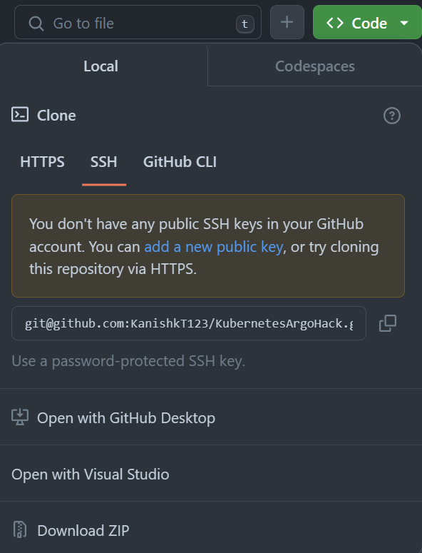

# 004 Argo CD Pulling

## Explanation

So far, we have:

1. Set up AKS and ACR
2. Installed Argo CD on the AKS Cluster under it's own namespace
3. Ensured we could login to the Argo CD CLI/UI
4. Enabled federated access for the Github Actions workflow
5. Pushed an image to the ACR through Github Actions

The next step is to ensure the image lands in the Kubernetes cluster. We do this through Kubernetes manifest files. We could also do it through Helm, but I will use Kubernetes manifests for this particular hack, since it's more straightforward.

Specifically, we will do the following:

1. Allow ArgoCD to access the private Git repository through SSH keys
2. Deploy the application through Argo CD

## Steps

1. Generate an SSH key pair. You can use the `ssh-keygen` command to generate the key pair.
2. Add the `rsa.pub` Public Key to the Github Repo: Settings > Security > Deploy Keys.
3. Now, we need to add a Kubernetes secret in the  `argocd` namespace. (If you installed Argo CD in a different namespace, use that namespace instead.) Run the following:

    `awk '{printf "%s\\n", $0}' ~/.ssh/id_rsa > ~/formatted_key.txt` 

    Or, for powershell:

    ```powershell
    Get-Content -Path ~/.ssh/id_rsa | ForEach-Object { "$_`n" } | Set-Content -Path ~/formatted_key.txt
    ```

4. We need to convert the key to a base64 encoding. This can be done with:

    `cat ~/formatted_key.txt | base64 -w 0`

    Or, for powershell:

    ```powershell
    Get-Content -Path ~/formatted_key.txt | ForEach-Object { [System.Convert]::ToBase64String([System.Text.Encoding]::UTF8.GetBytes($_)) }
    ```

5. Copy `ssh-secret-key.sample.yml` and name it `ssh-secret-key.yml`.

6. Replace the `sshPrivateKey` in `ssh-secret-key.yml` with the base64 encoded string and then run:

    `kubectl apply -f ssh-key-secret.yaml`

7. Replace the `repoUrl` in `application.yml` with your own Repository URL. This needs to be a `git@github` URL, which you can obtain from your Github repo, as shown below:

    

8. Move the `deploy` folder into the repository root and commit this change. MAKE SURE NOT TO COMMIT ANY SECRETS. 

    Now, the repository is ready for ArgoCD to start pulling files in. We just need to apply the `application.yml` and from this point on, GitOps should be enabled.

9. Run the following:

    `kubectl apply -f application.yaml`

10. At this point, the Argo CD dashboard should become active. Argo CD will be able to authenticate using SSH, pull from the repository, and apply the manifest files to the Kubernetes cluster.